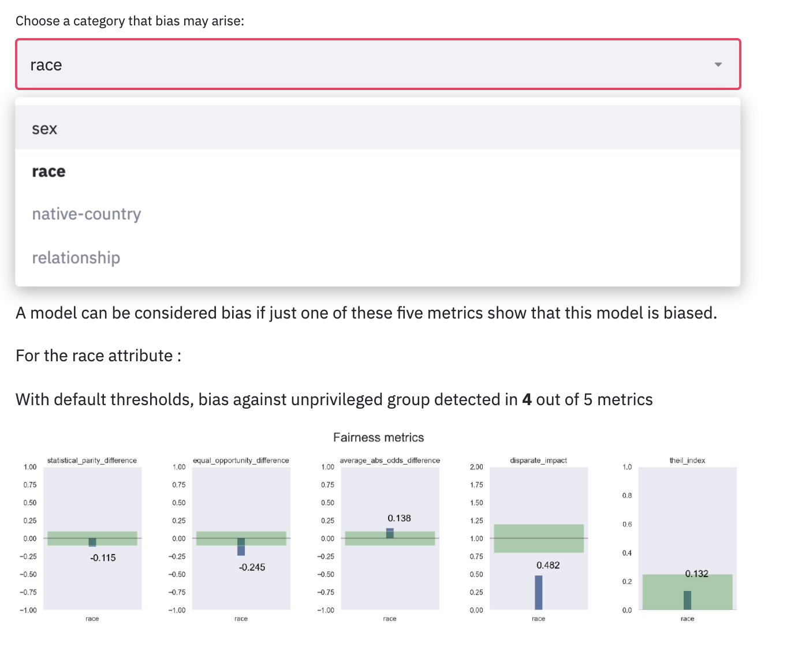

# Parity


### Overview
This repository contains codes that demonstrate the use of fairness metrics, bias mitigations and explainability tool.


### Installation

Install using:

```console
foo@bar:~$ pip install parity-fairness
```

### Bias Measurement Usage

Setup the data such that the target column is a binary string target. Then find out which features are the `privileged categories` and which values are `privileged values`. Afterwards, feed them into the function called `show_bias` like:

```
from parity.fairness_metrics import show_bias

priv_category = 'Race-White'
priv_value = 'True'
target_label = 'high pay'
unencoded_target_label = 'True'
cols_to_drop = ''

show_bias(data, priv_category, priv_value, target_label, unencoded_target_label, cols_to_drop)
```

# Bias and Fairness

A common problem with most machine learning models is bias from data. This notebook shows how to measure those biases and perform bias mitigation. A python package called [aif360](https://github.com/IBM/AIF360) can give us metrics and algorithms for bias measurement and mitigation

### Metrics

* Statistical Parity Difference
* Equal Opportunity Difference
* Average Absolute Odds Difference
* Disparate Impact
* Theil Index

### Statistical Parity Difference

This measure is based on the following formula : 


*Statistical imparity* is the difference between the probability that a random individual drawn from unprivileged is labeled 1 (so here that he has more than 50K for income) and the probability that a random individual from privileged is labeled 1.

Fairer scores are close to **0**.

More documentation here [One definition of algorithmic fairness: statistical parity](https://jeremykun.com/2015/10/19/one-definition-of-algorithmic-fairness-statistical-parity/).

### Equal Opportunity Difference

This metric is just a difference between the true positive rate of unprivileged group and the true positive rate of privileged group.


 
Fairer scores are close to **0**.

### Average Absolute Odds Difference

This measure is using both false positive rate and true positive rate to calculate the bias.


Fairer scores are close to **0**.

### Disparate Impact

For this metric we use the following formula :


Like the first metric we use both probabities of a random individual drawn from unprivileged or privileged with a label of 1 but here it's a ratio. 

Better disparate impact should be closer to **1**.

### Theil Index

This measure is also known as the generalized entropy index but with $\alpha$ equals to 1. More information here [Generalized Entropy Index](https://en.wikipedia.org/wiki/Generalized_entropy_index)).


Fairer scores are close to **0**.


Some metrics need predictions while others just the original dataset. This is why we will use 2 classes of the aif360 package : `ClassificationMetric` and `BinaryLabelDatasetMetric`. 

### For metrics that require predictions: 
* [Equal Opportunity Difference: ](https://aif360.readthedocs.io/en/latest/modules/metrics.html#aif360.metrics.ClassificationMetric.equal_opportunity_difference) `equal_opportunity_difference()`
* [Average Absolute Odds Difference: ](https://aif360.readthedocs.io/en/latest/modules/metrics.html#aif360.metrics.ClassificationMetric.average_abs_odds_difference) `average_abs_odds_difference()`
* [Theil Index : ](https://aif360.readthedocs.io/en/latest/modules/metrics.html#aif360.metrics.ClassificationMetric.theil_index) `theil_index()`

### For metrics that don't require predictions: 
* [Statistical Parity Difference: ](https://aif360.readthedocs.io/en/latest/modules/metrics.html#aif360.metrics.BinaryLabelDatasetMetric.statistical_parity_difference) `statistical_parity_difference()`
* [Disparate Impact: ](https://aif360.readthedocs.io/en/latest/modules/metrics.html#aif360.metrics.ClassificationMetric.disparate_impact) `disparate_impact()`


### Sample Display

The fairness metrics should display like this:

